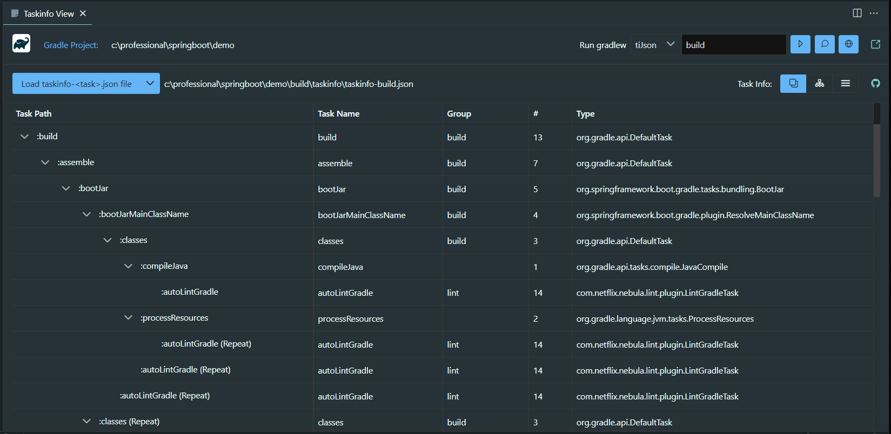
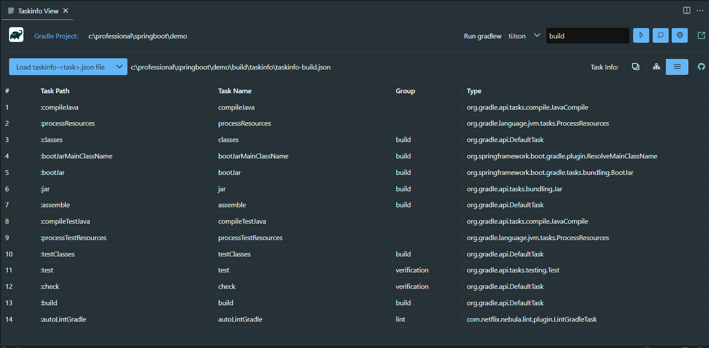
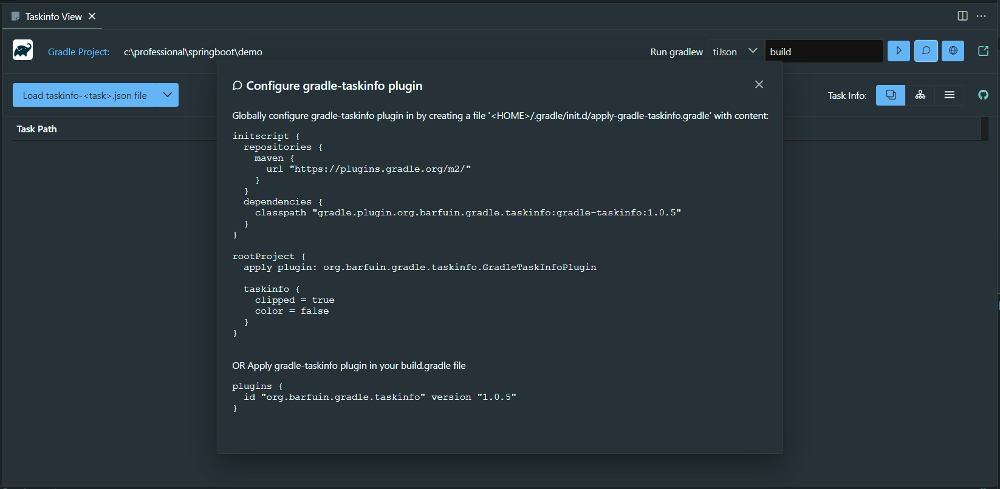

# Taskinfo Viewer based on VSCode Webview

This extension lets you view the taskinfo files generated by the gradle plugin [org.barfuin.gradle.taskinfo](https://plugins.gradle.org/plugin/org.barfuin.gradle.taskinfo).

That plugin can generate a json file showing the dependency tree of gradle tasks.

For example in a gralde based project ```demo```:

```
> cd demo
> gradlew tiJson build
```

this will generate the file:

```
build/taskinfo/taskinfo-build.json
```

which shows the dependency tree of the ```build``` task.

# How to use?

To view this output file open command palette (Ctrl/Cmd + Shift + P) and select ```Gradle: Taskinfo View``` to show the Taskinfo View. Then load the file into that view.

## Taskinfo Tree



## Taskinfo Org Chart


## Taskinfo Order



## Configure gradle-taskinfo plugin



## Development

This project was generated with `Angular CLI`, so it can be be used for angular development by default.

To test this extension in vscode context:
```
$ yarn install
$ yarn run build
```

After build process you can press F5 to "Start Debugging" (or: select in menu "Debug" -> "Start Debugging"). A new window will open in which you need to open command palette (Ctrl/Cmd + Shift + P) and select "Gradle: Taskinfo View" to start your extension.

## Packaging

To generate extension in `VSIX` format execute the package command:

```
yarn run package
```

Finally the generated VSIX file with VSCode extension should appear in the root folder of your project.

# Acknowledgements

Project was inspired by:

https://github.com/4gray/vscode-webview-angular
